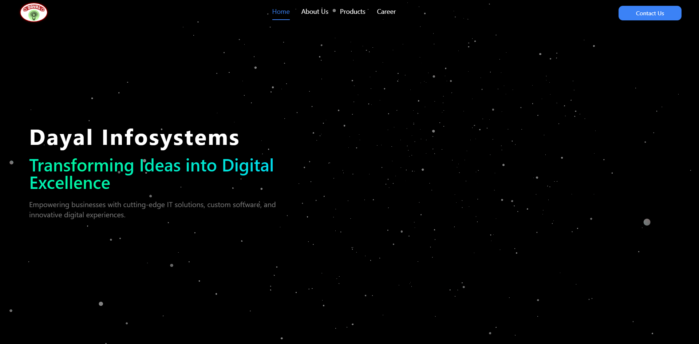
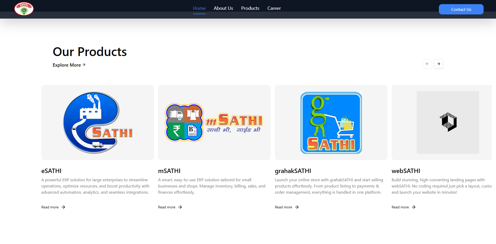

# Infosystem Website

This is a **React-based website** developed for **Infosystem**, featuring a sleek, modern design with **Tailwind CSS** styling and **Framer Motion animations** for a visually stunning user experience.

---

## 🚀 **Features**

- **Responsive Design:** Fully responsive and mobile-friendly layout.  
- **Tailwind CSS:** Clean and efficient styling with utility-first classes.  
- **Framer Motion Animations:** Smooth and eye-catching animations.  
- **Vite-Powered:** Fast build and lightning-fast development.  
- **SEO-Friendly:** Optimized for better search engine rankings.  
- **Reusable Components:** Modular design for easy maintenance.  

---

## 🛠️ **Tech Stack**

- **Frontend:** React.js (with Vite)  
- **UI Library:** Tailwind CSS  
- **Animations:** Framer Motion  
- **Styling:** Tailwind CSS  
- **Version Control:** Git  

---

##  **Screenshots**

- **Home Page Hero Section:**

- **Home Page Product Section:**
